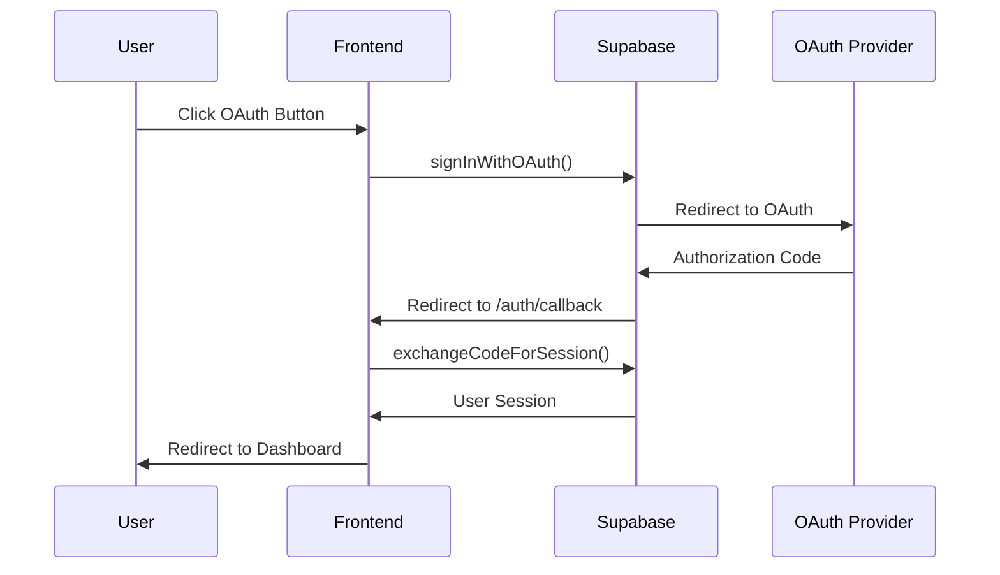
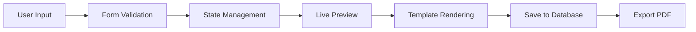

# 🚀 APPLYACE - COMPREHENSIVE DEVELOPMENT BUILD GUIDE

## 📋 **PROJECT OVERVIEW**

**ApplyAce** - The Complete Career Success Platform
- **Technology Stack**: Vite + React (Frontend) + Node.js/Express (Backend) + Supabase (Database)
- **Architecture**: Full-stack TypeScript application with OAuth authentication
- **Port Configuration**: Frontend (3000) + Backend (8000)

---

## 🏗️ **ARCHITECTURE & DEPENDENCIES**

### **Frontend Stack (Vite + React)**
```json
{
  "framework": "Vite + React",
  "language": "TypeScript",
  "ui_library": "Shadcn UI + Radix UI",
  "styling": "Tailwind CSS",
  "state_management": "React Context + Hooks",
  "routing": "React Router DOM v6",
  "animations": "Framer Motion",
  "notifications": "Sonner",
  "forms": "React Hook Form + Zod"
}
```

### **Backend Stack (Node.js + Express)**
```json
{
  "runtime": "Node.js",
  "framework": "Express.js",
  "language": "TypeScript",
  "database": "Supabase (PostgreSQL)",
  "authentication": "Supabase Auth",
  "file_upload": "Multer",
  "cors": "CORS middleware",
  "security": "Helmet + Rate limiting"
}
```

### **Database (Supabase)**
```json
{
  "provider": "Supabase",
  "database": "PostgreSQL",
  "auth": "Supabase Auth",
  "storage": "Supabase Storage",
  "realtime": "Supabase Realtime",
  "edge_functions": "Supabase Edge Functions"
}
```

---

## 🔧 **SETUP & INSTALLATION**

### **Prerequisites**
- Node.js 18+ 
- npm or yarn
- Git
- Supabase account

### **1. Clone Repository**
```bash
git clone <repository-url>
cd "Ai CV Application"
```

### **2. Frontend Setup**
```bash
cd frontend
npm install
```

**Key Dependencies:**
```bash
# Core React
npm install react react-dom react-router-dom

# UI & Styling
npm install @radix-ui/react-* shadcn/ui tailwindcss

# Development
npm install -D typescript @types/react @types/node vite

# Utilities
npm install framer-motion sonner react-hook-form zod
```

### **3. Backend Setup**
```bash
cd backend
npm install
```

**Key Dependencies:**
```bash
# Core Express
npm install express cors helmet morgan

# Database
npm install @supabase/supabase-js

# File Processing
npm install multer mammoth pdf-parse

# Development
npm install -D typescript @types/express @types/cors
```

### **4. Environment Configuration**

**Frontend (.env)**
```env
VITE_SUPABASE_URL=your_supabase_url
VITE_SUPABASE_ANON_KEY=your_supabase_anon_key
VITE_API_BASE_URL=http://localhost:8000
```

**Backend (.env)**
```env
SUPABASE_URL=your_supabase_url
SUPABASE_SERVICE_ROLE_KEY=your_service_role_key
STRIPE_SECRET_KEY=your_stripe_key
PORT=8000
```

---

## 🚀 **RUNNING THE APPLICATION**

### **Development Mode**

**Start Backend Server:**
```bash
cd backend
npm run server
# Server runs on http://localhost:8000
```

**Start Frontend Server:**
```bash
cd frontend
npm run dev
# Frontend runs on http://localhost:3000
```

### **Production Build**
```bash
# Frontend
cd frontend
npm run build

# Backend
cd backend
npm run build
```

---

## 📊 **DATABASE SCHEMA**

### **Core Tables**

**Users Table (Supabase Auth)**
```sql
-- Managed by Supabase Auth
auth.users (
  id uuid PRIMARY KEY,
  email text UNIQUE,
  created_at timestamp,
  updated_at timestamp
)
```

**CVs Table**
```sql
CREATE TABLE cvs (
  id uuid DEFAULT gen_random_uuid() PRIMARY KEY,
  user_id uuid REFERENCES auth.users(id) ON DELETE CASCADE,
  title text NOT NULL,
  content jsonb NOT NULL,
  template_id text,
  is_public boolean DEFAULT false,
  created_at timestamp DEFAULT now(),
  updated_at timestamp DEFAULT now()
);
```

**Skills Table**
```sql
CREATE TABLE skills (
  id SERIAL PRIMARY KEY,
  name text UNIQUE NOT NULL,
  category text,
  created_at timestamp DEFAULT now()
);
```

**CV Skills Junction Table**
```sql
CREATE TABLE cv_skills (
  cv_id uuid REFERENCES cvs(id) ON DELETE CASCADE,
  skill_id integer REFERENCES skills(id) ON DELETE CASCADE,
  PRIMARY KEY (cv_id, skill_id)
);
```

---

## 🔐 **AUTHENTICATION SYSTEM**

### **OAuth Providers**
- **Google OAuth**: `google` provider
- **LinkedIn OAuth**: `linkedin_oidc` provider (OpenID Connect)

### **Auth Flow**


### **Auth Components**
- `AuthForm.tsx` - Login/Signup form with OAuth buttons
- `AuthCallback.tsx` - OAuth redirect handler
- `useAuth.ts` - Authentication hook
- `auth.tsx` - Auth context provider

---

## 🎨 **CV BUILDER SYSTEM**

### **Architecture**
```typescript
// CV Builder Components
CVBuilderModern.tsx          // Main builder component
CVBuilderStepper.tsx         // Step navigation
steps/
  PersonalInfoStep.tsx       // Personal information
  ExperienceStep.tsx         // Work experience
  EducationStep.tsx          // Education history
  SkillsStep.tsx            // Skills & competencies
  ProjectsStep.tsx          // Projects portfolio
  CertificationsStep.tsx    // Certifications
  ReferencesStep.tsx        // References
  TemplateStep.tsx          // Template selection
  PreviewStep.tsx           // Live preview
```

### **Template System**
```typescript
// Template Categories
const TEMPLATES = {
  basic: ['Basic Modern', 'Professional Clean'],
  creative: ['Creative Modern', 'Executive Formal'],
  // 20 unique templates total
};

// Template Features
- ATS-compliant designs
- Responsive layouts
- Live preview
- Export to PDF
- Mobile optimization
```

### **Data Flow**


---

## 🔗 **API ENDPOINTS**

### **CV Management**
```typescript
// CV Operations
POST   /api/cv/create        // Create new CV
GET    /api/cv              // Get user's CVs
GET    /api/cv/:id          // Get specific CV
PUT    /api/cv/:id          // Update CV
DELETE /api/cv/:id          // Delete CV
```

### **Authentication**
```typescript
// Auth Operations
POST   /api/auth/login      // Email/password login
POST   /api/auth/register   // User registration
POST   /api/auth/logout     // User logout
GET    /api/auth/profile    // Get user profile
```

### **File Upload**
```typescript
// File Operations
POST   /api/cv/upload       // Upload CV file
GET    /api/cv/:id/download // Download CV as PDF
```

---

## 🎯 **KEY FEATURES**

### **1. CV Builder**
- 9-step wizard interface
- Live preview with real-time updates
- 20 professional templates
- Test data toggle for demos
- Mobile-responsive design

### **2. OAuth Authentication**
- Google OAuth integration
- LinkedIn OAuth integration
- Secure session management
- Auth callback handling

### **3. CV Upload & Management**
- File upload (PDF, DOCX, TXT)
- Text input for CV content
- Database persistence
- CV analysis and optimization

### **4. Template System**
- ATS-compliant designs
- Industry-specific templates
- Responsive layouts
- Export functionality

---

## 🚨 **TROUBLESHOOTING**

### **Common Issues**

**Port Conflicts:**
```bash
# Kill processes on ports
netstat -ano | findstr :3000
taskkill /PID <PID> /F

netstat -ano | findstr :8000
taskkill /PID <PID> /F
```

**Database Connection:**
```bash
# Test Supabase connection
curl https://your-project.supabase.co/rest/v1/
```

**OAuth Issues:**
- Verify redirect URLs in Supabase dashboard
- Check OAuth provider configuration
- Ensure proper environment variables

**Build Errors:**
```bash
# Clear caches
npm cache clean --force
rm -rf node_modules
npm install
```

---

## 📱 **MOBILE RESPONSIVENESS**

### **Breakpoints**
```css
/* Mobile First Approach */
@media (min-width: 640px) { /* sm */ }
@media (min-width: 768px) { /* md */ }
@media (min-width: 1024px) { /* lg */ }
@media (min-width: 1280px) { /* xl */ }
```

### **Touch Targets**
```css
/* Minimum 44px touch targets */
.touch-target {
  min-height: 44px;
  min-width: 44px;
}
```

---

## 🔒 **SECURITY CONSIDERATIONS**

### **Authentication**
- JWT tokens with Supabase
- Secure session management
- OAuth provider validation

### **Data Protection**
- Input validation with Zod
- SQL injection prevention
- XSS protection with Helmet

### **Rate Limiting**
```typescript
// Express rate limiting
const limiter = rateLimit({
  windowMs: 15 * 60 * 1000, // 15 minutes
  max: 100 // limit each IP to 100 requests per windowMs
});
```

---

## 📈 **PERFORMANCE OPTIMIZATION**

### **Frontend**
- Code splitting with React.lazy()
- Image optimization
- Bundle size monitoring
- Lazy loading components

### **Backend**
- Database query optimization
- Caching strategies
- File upload optimization
- API response compression

---

## 🧪 **TESTING**

### **Frontend Testing**
```bash
# Run tests
npm test

# Test coverage
npm run test:coverage
```

### **Backend Testing**
```bash
# Run API tests
npm run test:api

# Integration tests
npm run test:integration
```

---

## 📚 **RESOURCES & REFERENCES**

### **Documentation**
- [Vite Documentation](https://vitejs.dev/)
- [React Documentation](https://react.dev/)
- [Supabase Documentation](https://supabase.com/docs)
- [Tailwind CSS](https://tailwindcss.com/docs)
- [Shadcn UI](https://ui.shadcn.com/)

### **Development Tools**
- [React DevTools](https://react.dev/learn/react-developer-tools)
- [Supabase Dashboard](https://app.supabase.com/)
- [Postman/Insomnia](https://www.postman.com/) for API testing

---

## 🎯 **DEPLOYMENT**

### **Frontend Deployment**
```bash
# Build for production
npm run build

# Deploy to Vercel/Netlify
vercel --prod
```

### **Backend Deployment**
```bash
# Build TypeScript
npm run build

# Deploy to Railway/Render
railway up
```

---

**Last Updated**: January 8, 2025
**Version**: 1.0.0
**Status**: Production Ready 