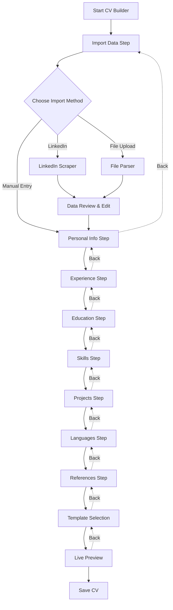
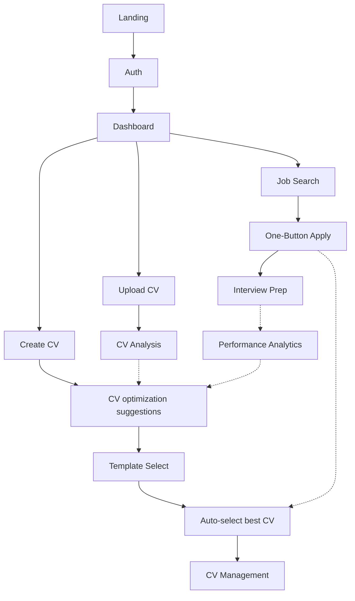

# 🚀 APPLYACE DEVELOPMENT GUIDELINES & CODING STANDARDS

## 📋 **CRITICAL DEVELOPMENT DIRECTIVES**

### **🎯 HOLISTIC APPROACH - MANDATORY**
```
ALWAYS take a holistic approach when coding:
1. Understand BOTH backend AND frontend structure
2. Know the FULL SCOPE of the application
3. Understand how ALL PARTS link together
4. NEVER break other functions when adding new code
5. ALWAYS reference PRD, project notes, and development guidelines BEFORE making changes
```

### **⚠️ VERIFICATION PROTOCOL - NON-NEGOTIABLE**
```
NEVER assume anything works without verification:
✅ File references and imports are EXACT matches
✅ Database schema matches EXACTLY (column names, data types, constraints)  
✅ Component exports/imports are correct
✅ Routes are properly configured
✅ Environment variables are loaded
✅ Servers are running on correct ports
✅ Test EVERY piece before declaring it working
```

### **🔧 DEBUGGING PROTOCOL - CRITICAL**
```
When debugging persistent errors:
1. KILL ALL PORTS: taskkill /F /IM node.exe
2. CLEAR ALL CACHES: npm cache clean --force
3. RESTART FRESH: npm run dev
4. Cache problems are common and require complete clean restart
5. Identify the EXACT error (e.g., "storageOperations not exported")
6. Find the EXACT fix (e.g., server restart after export was added)
7. Document WHY it worked to prevent repeating the same debugging cycle
```

---

## 🏗️ **ARCHITECTURE REQUIREMENTS FROM PRD**

### **Core Application Structure**
```typescript
// Main Application Modules (ALL must work together seamlessly)
1. CV Builder & Optimizer (AI-powered CV creation)
2. One-Button Job Applications (Automated job application system) 
3. Interview Coach (AI-driven interview preparation)

// Critical Integration Points
- CV → Job Apply: Auto-select best CV for job
- Job Apply → Interview: Automatic interview preparation  
- Interview → Analytics: Track success rates
- Analytics → CV: Improve CV based on results
```

### **Database Schema Validation - MANDATORY**
```sql
-- ALWAYS validate existing database structure before writing SQL scripts
-- Check: table schemas, column data types, primary keys (UUID vs BIGINT), foreign keys, constraints
-- Use information_schema queries to inspect current structure
-- Create compatible scripts that match existing types

-- Example validation query:
SELECT column_name, data_type, is_nullable, column_default 
FROM information_schema.columns 
WHERE table_name = 'cvs' AND table_schema = 'public';
```

---

## 🎨 **CV BUILDER SYSTEM - COMPREHENSIVE REQUIREMENTS**

### **CV Builder Core Features - MANDATORY**
```typescript
// Essential CV Builder Functionality:
1. LinkedIn Scraping: Import professional data from LinkedIn profiles
2. File Upload & Parsing: Extract data from PDF, DOCX, TXT files
3. Step-by-Step Builder: Guided form with validation
4. Template Selection: 20 unique, professional templates
5. Live Preview: Real-time CV preview with selected template
6. Data Persistence: Save to database with proper schema
7. Export Options: PDF download functionality

// Data Import Requirements:
- LinkedIn: Full name, job title, location, summary, experience, education, skills
- File Upload: Parse and extract all relevant CV data
- Manual Entry: Complete form-based data entry
- Data Validation: Ensure all required fields are completed
```

### **Template System - 20 Unique Professional Templates**
```typescript
// Template Requirements:
- 20 COMPLETELY UNIQUE templates (no replication)
- Each template must be distinct in layout, typography, and visual style
- ATS-compliant designs that pass automated screening
- Industry-standard formats (Harvard-inspired as foundation)
- Professional color schemes with subtle accents
- Responsive design for all screen sizes
- Live preview functionality

// Template Categories:
1. Classic (Harvard Classic, Legal Traditional, Government Formal)
2. Modern (Tech Minimal, Healthcare Clean, Startup Modern)
3. Creative (Creative Portfolio, Marketing Dynamic, Design Creative)
4. Executive (Modern Executive, Consulting Professional, Executive Bold)
5. Minimal (Tech Minimal, Research Academic)

// Template Features:
- Unique typography combinations
- Distinct color schemes (navy, charcoal, emerald, burgundy, slate)
- Different layouts (single-column, two-column, sidebar, asymmetric)
- Professional styling (not cheap-looking)
- 2025 industry standards
- Mobile-responsive design
```

### **Template Tier System - Development Mode**
```typescript
// Template Access Control:
const isTemplateAccessible = (template: CVTemplate) => {
  // Development mode: all templates accessible for testing
  return true;
  
  // Production mode (commented out for testing):
  // const allowedTemplates = getTemplatesByTier(userTier);
  // return allowedTemplates.some(t => t.id === template.id);
};

// Tier Structure:
- Free: 2 templates (Harvard Classic, Education Scholar)
- Starter: 6 templates (Tech Minimal, Healthcare Clean, Engineering Precision, etc.)
- Professional: 8 templates (Modern Executive, Finance Professional, Legal Traditional, etc.)
- Career Pro: 6 templates (Creative Portfolio, Marketing Dynamic, Sales Dynamic, etc.)
- Elite Executive: 2 templates (Consulting Professional, Executive Bold)
```

### **CV Builder User Flow - Complete Journey**


### **Data Import & Parsing Requirements**
```typescript
// LinkedIn Scraping:
- Extract: full_name, job_title, location, summary, experiences, education, skills
- Handle: public profile data only
- Validation: LinkedIn URL format validation
- Error Handling: Graceful fallback for failed scraping

// File Upload & Parsing:
- Supported Formats: PDF, DOCX, TXT
- Extraction: All CV sections (personal, experience, education, skills, etc.)
- Data Mapping: Convert extracted text to structured CV data
- Validation: Review and edit extracted data
- Error Handling: Clear error messages for unsupported files

// Data Flow:
1. Upload/Import → 2. Parse/Extract → 3. Review/Edit → 4. Template Selection → 5. Preview → 6. Save
```

### **Template Selector - Critical Requirements**
```typescript
// CV Template Selector MUST ALWAYS provide:
✅ Scroll or pagination controls for ALL templates
✅ Left/right arrow buttons (desktop)
✅ Swipe/scroll support (mobile)  
✅ Visible indicators of current template
✅ Accessible (keyboard, screen reader)
✅ Works for ALL template types
✅ Navigation functionality MUST NOT be removed/broken

// Template Sizing - Layout Specific
const getPreviewDimensions = (layout: string) => {
  switch (layout) {
    case 'two-column': return { width: '280px', height: '320px', scale: 'scale-95' };
    case 'creative': return { width: '260px', height: '340px', scale: 'scale-90' };
    case 'modern': return { width: '250px', height: '330px', scale: 'scale-95' };
    case 'classic': return { width: '240px', height: '320px', scale: 'scale-90' };
    default: return { width: '240px', height: '320px', scale: 'scale-90' };
  }
};
```

### **Live Preview System - Real-time Rendering**
```typescript
// Preview Requirements:
- Real-time rendering of CV with selected template
- Responsive design for all screen sizes
- Accurate representation of final output
- Template-specific styling (colors, fonts, layout)
- Print-friendly formatting
- Export-ready design

// Preview Components:
- Template-specific CSS classes
- Dynamic content rendering
- Responsive breakpoints
- Print media queries
- Accessibility features
```

---

## 💰 **PRICING & BUSINESS MODEL**

### **VAT-Inclusive Pricing Structure**
```typescript
const PRICING_TIERS = {
  free: { price: 0, features: ['1 basic CV analysis'] },
  payAsYouGo: { price: 2.49, features: ['VAT-inclusive', 'No monthly commitment'] },
  starter: { price: 11.99, features: ['5 detailed analyses', 'Student discount'] },
  professional: { price: 17.99, features: ['Unlimited analyses', 'Advanced AI', 'MOST POPULAR'], mostPopular: true },
  careerPro: { price: 35.99, features: ['Everything + human review', 'Premium coaching', 'NO 1-on-1 coaching'] },
  eliteExecutive: { price: 69.99, features: ['Everything + AI-backed 1-on-1 coaching'] }
};

// Annual Discounts
const ANNUAL_DISCOUNTS = {
  sixMonth: 0.30, // 30% off
  twelveMonth: 0.50 // 50% off  
};

// Commission Structure
const COMMISSION_RATE = 0.20; // 20% base commission
```

### **Business Model - AI Automation**
```typescript
// ApplyAce Business Model Requirements:
- Fully AI-automated business (zero human support)
- Commission-based sales (20% commission)
- Zero marketing spend (affiliate-driven growth)
- Product-led growth like Cursor.ai
- Quality drives word-of-mouth recommendations
- Eliminates human support through AI agents, chatbots, automated systems
```

---

## 🔗 **CROSS-MODULE INTEGRATION**

### **User Flow Requirements - Complete Journey**


### **One-Button Apply Implementation**
```typescript
// Core Workflow Requirements:
1. User finds job → Clicks "Apply with CV"
2. System auto-selects best CV → Based on job match score  
3. AI generates cover letter → Tailored to job and CV
4. User reviews and submits → Application saved to database
5. Automatic redirect to interview coaching → Job-specific preparation
```

---

## 🔒 **AUTHENTICATION & SECURITY**

### **LinkedIn OAuth Implementation**
```typescript
// Fixed Implementation Pattern:
const handleLinkedInAuth = async () => {
  try {
    // Generate OAuth URL without immediate redirect
    const authUrl = await generateLinkedInAuthUrl();
    
    // Add proper error checking and small delay
    if (!authUrl) throw new Error('Failed to generate auth URL');
    
    // Use setTimeout for timing issues (100ms delay)
    setTimeout(() => {
      window.location.href = authUrl;
    }, 100);
    
  } catch (error) {
    console.error('LinkedIn auth error:', error);
    setError('Authentication failed. Please try again.');
  }
};
```

---

## 🎯 **CV BUILDER IMPLEMENTATION CHECKLIST**

### **Phase 1: Core Infrastructure ✅**
- [x] CV Builder page structure
- [x] Step-by-step navigation system
- [x] Template data structure (20 unique templates)
- [x] Import modals (LinkedIn, File Upload)
- [x] Basic form components

### **Phase 2: Data Import & Parsing**
- [ ] LinkedIn scraper integration
- [ ] File upload and parsing (PDF, DOCX, TXT)
- [ ] Data validation and error handling
- [ ] Data mapping and transformation

### **Phase 3: Template System**
- [ ] Template selector component
- [ ] Live preview system
- [ ] Template-specific styling
- [ ] Responsive design implementation

### **Phase 4: Form Components**
- [ ] Personal information form
- [ ] Experience form with dynamic entries
- [ ] Education form with validation
- [ ] Skills, projects, languages, references forms

### **Phase 5: Integration & Testing**
- [ ] Database integration
- [ ] Save/load functionality
- [ ] Export to PDF
- [ ] Cross-module integration testing

### **Phase 6: Polish & Optimization**
- [ ] Performance optimization
- [ ] Accessibility improvements
- [ ] Mobile responsiveness
- [ ] User experience refinements

---

## 🚨 **CRITICAL SUCCESS FACTORS**

### **CV Builder Must Deliver:**
1. **Smooth, Glitch-Free Experience** - No jank, no reloads, seamless flows
2. **Professional Templates** - 20 unique, industry-standard designs
3. **Data Import Accuracy** - LinkedIn scraping and file parsing must work perfectly
4. **Live Preview** - Real-time template rendering with user data
5. **Mobile-First Design** - Responsive across all devices
6. **ATS Compliance** - All templates must pass automated screening
7. **User-Friendly Navigation** - Intuitive step-by-step process
8. **Data Persistence** - Reliable save/load functionality
9. **Export Capability** - High-quality PDF output
10. **Integration Ready** - Seamless connection with job application system

### **Quality Assurance Standards:**
- All templates must render correctly in live preview
- Data import must populate all fields accurately
- Navigation must work smoothly between all steps
- Save functionality must work reliably
- Export must produce professional-quality PDFs
- Mobile experience must be excellent
- Performance must be fast and responsive

---

## 🎯 **COMPONENT ARCHITECTURE STANDARDS**

### **Modular Design Principles**
```typescript
// Component Structure Requirements:
interface ComponentProps {
  // Always use TypeScript interfaces
  data: RequiredType;
  onAction: (param: Type) => void;
  className?: string; // Optional styling
  children?: React.ReactNode; // Composition support
}

// Error Boundaries - Required for all major components
class ErrorBoundary extends React.Component {
  // Implement proper error handling
  // Graceful fallbacks for component failures  
  // User-friendly error messages
}

// Loading States - Required for all async operations
const LoadingState = () => (
  <div className="flex items-center justify-center p-4">
    <Spinner className="w-6 h-6" />
    <span className="ml-2">Loading...</span>
  </div>
);
```

### **File Organization Standards**
```
src/
├── components/
│   ├── auth/           # Authentication components
│   ├── cv/             # CV-related components  
│   ├── dashboard/      # Dashboard components
│   ├── jobs/           # Job application components
│   ├── interview/      # Interview coaching components
│   └── ui/             # Reusable UI components
├── hooks/              # Custom React hooks
├── lib/                # Utility libraries and services
├── pages/              # Page components (routing)
└── data/               # Static data and configurations
```

---

## 📱 **RESPONSIVE DESIGN REQUIREMENTS**

### **Mobile-First Implementation**
```css
/* Required Breakpoints */
.responsive-component {
  /* Mobile first (default) */
  width: 100%;
  padding: 1rem;
  
  /* Tablet */
  @media (min-width: 768px) {
    padding: 1.5rem;
  }
  
  /* Desktop */
  @media (min-width: 1024px) {
    max-width: 1200px;
    margin: 0 auto;
    padding: 2rem;
  }
}

/* Touch-friendly interactions */
.touch-target {
  min-height: 44px; /* Minimum touch target size */
  min-width: 44px;
}
```

### **Template Preview Responsive Sizing**
```typescript
// Dynamic sizing for different template layouts
const getResponsivePreviewSize = (layout: string, screenSize: 'mobile' | 'tablet' | 'desktop') => {
  const baseSizes = getPreviewDimensions(layout);
  
  switch (screenSize) {
    case 'mobile':
      return { ...baseSizes, scale: 'scale-75' };
    case 'tablet': 
      return { ...baseSizes, scale: 'scale-85' };
    case 'desktop':
    default:
      return baseSizes;
  }
};
```

---

## 🚀 **PERFORMANCE OPTIMIZATION**

### **Code Splitting & Lazy Loading**
```typescript
// Lazy load heavy components
const CVBuilder = lazy(() => import('./components/cv/CVBuilder'));
const InterviewCoach = lazy(() => import('./components/interview/InterviewCoach'));

// Wrap in Suspense with proper fallback
<Suspense fallback={<LoadingState />}>
  <CVBuilder />
</Suspense>
```

### **Database Query Optimization**
```sql
-- Always include proper indexes for performance
CREATE INDEX CONCURRENTLY idx_cvs_user_id ON cvs(user_id);
CREATE INDEX CONCURRENTLY idx_jobs_user_id ON jobs(user_id);
CREATE INDEX CONCURRENTLY idx_applications_user_job ON job_applications(user_id, job_id);

-- Use transactions for critical operations
BEGIN;
  INSERT INTO cvs (...) VALUES (...);
  INSERT INTO ai_analyses (...) VALUES (...);
COMMIT;
```

---

## 🧪 **TESTING STANDARDS**

### **Required Test Coverage**
```typescript
// Unit Tests - All utility functions
describe('CV Operations', () => {
  test('should create CV with valid data', async () => {
    const result = await cvOperations.createCV(validCVData);
    expect(result.id).toBeDefined();
    expect(result.user_id).toBe(testUserId);
  });
});

// Integration Tests - API endpoints  
describe('CV API Integration', () => {
  test('should handle CV creation flow', async () => {
    // Test complete user workflow
  });
});

// Component Tests - UI functionality
describe('CVTemplateSelector', () => {
  test('should navigate between templates', () => {
    // Test navigation controls work properly
  });
});
```

---

## 💾 **VERSION CONTROL & DEPLOYMENT**

### **Git Workflow Standards**
```bash
# Feature branch naming
git checkout -b feature/cv-template-sizing-fix
git checkout -b bugfix/authentication-redirect-issue
git checkout -b enhancement/mobile-navigation

# Commit message format
git commit -m "fix(cv): resolve template sizing issues for higher tier layouts

- Add dynamic preview dimensions for two-column, creative, modern layouts
- Fix scale transforms for proper template display
- Ensure navigation controls remain functional
- Resolves template display issues mentioned in user feedback"
```

### **Deployment Checklist**
```bash
# Pre-deployment verification
✅ All tests passing (npm test)
✅ Build successful (npm run build)  
✅ Environment variables configured
✅ Database migrations applied
✅ Security audit passed (npm audit)
✅ Performance benchmarks met
✅ Cross-browser testing completed
✅ Mobile responsiveness verified
```

---

## 🔗 **URL FORMATTING STANDARDS**

### **Always Use Clickable Links**
```markdown
❌ WRONG: http://localhost:3000/cv-builder
✅ CORRECT: [CV Builder](http://localhost:3000/cv-builder)

❌ WRONG: Visit http://localhost:8080/debug for testing
✅ CORRECT: [Test Backend](http://localhost:8080/debug) for testing
```

---

## 📊 **SUCCESS METRICS & KPIs**

### **Technical Performance Targets**
```typescript
const PERFORMANCE_TARGETS = {
  pageLoadTime: '< 3 seconds',
  apiResponseTime: '< 500ms', 
  databaseQueryTime: '< 100ms',
  applicationCompletionRate: '85%+',
  timeToApply: '< 2 minutes',
  userSatisfaction: '4.5+ stars'
};
```

### **Business Impact Tracking**
```typescript
const BUSINESS_METRICS = {
  applicationSuccessRate: 'Track improvement',
  userRetention: 'Measure engagement', 
  featureAdoption: 'Monitor usage',
  conversionRate: 'Free to paid transitions',
  revenueGrowth: 'Monthly recurring revenue'
};
```

---

## 🎯 **QUALITY ASSURANCE CHECKLIST**

### **Before Every Commit**
```
□ Code follows TypeScript best practices
□ All imports/exports are correct
□ Database operations include proper error handling
□ UI components are responsive (mobile/tablet/desktop)
□ Loading states implemented for async operations
□ Error boundaries in place for critical components
□ Accessibility features included (ARIA labels, keyboard navigation)
□ Performance optimized (lazy loading, code splitting)
□ Security considerations addressed (RLS, input validation)
□ Cross-module integration tested
□ PRD requirements satisfied
□ No breaking changes to existing functionality
```

### **Manual Testing Protocol**
```
1. Test complete user workflows (end-to-end)
2. Verify responsive design on multiple devices
3. Check cross-browser compatibility  
4. Validate database operations
5. Test error scenarios and edge cases
6. Confirm accessibility features work
7. Performance test with realistic data volumes
8. Security test authentication and authorization
```

---

## 🚨 **CRITICAL WARNINGS**

### **NEVER DO THESE**
```
❌ Never assume code works without testing
❌ Never skip database schema validation  
❌ Never break existing navigation functionality
❌ Never ignore mobile responsiveness
❌ Never skip error handling for user operations
❌ Never deploy without proper testing
❌ Never ignore TypeScript errors
❌ Never break cross-module integration
❌ Never skip accessibility features
❌ Never ignore security best practices
```

### **ALWAYS DO THESE**
```
✅ Always test holistically across all modules
✅ Always validate database compatibility  
✅ Always maintain navigation functionality
✅ Always implement mobile-first design
✅ Always handle errors gracefully
✅ Always verify before declaring "working"
✅ Always use TypeScript properly
✅ Always consider cross-module impact
✅ Always include accessibility features
✅ Always follow security best practices
```

---

## 📚 **REFERENCE DOCUMENTATION**

- **PRD**: `PRODUCT_REQUIREMENTS_DOCUMENT.md` - Product requirements and specifications
- **Implementation**: `ONE-BUTTON-APPLY-IMPLEMENTATION.md` - Complete feature implementation guide  
- **Database**: `complete-database-setup.sql` - Full database schema and setup
- **Project Status**: `PROJECT_STATUS.md` - Current development status and priorities

---

**🎯 REMEMBER: The goal is to build a robust, user-centric, reliable ApplyAce platform that follows modular architecture principles and provides seamless cross-module integration. Every line of code should contribute to this vision.** 