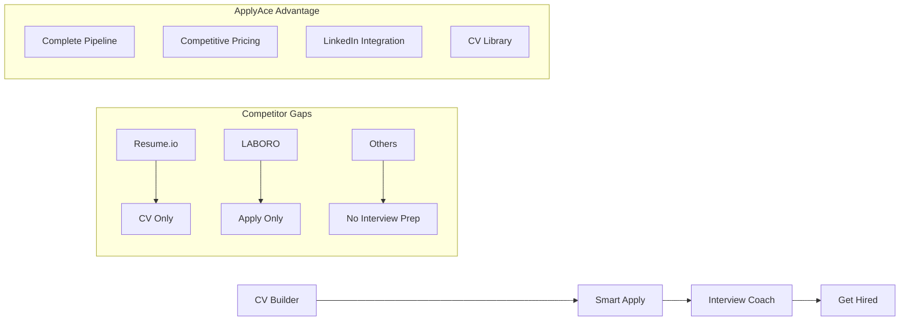

# 🚀 APPLYACE - COMPREHENSIVE PRODUCT REQUIREMENTS DOCUMENT (PRD) v4.0

## 📋 **Document Information**
- **Product Name**: ApplyAce - The Complete Career Success Platform
- **Version**: 4.0.0 (Global Market + Competitive Pricing Strategy)
- **Date**: January 2025
- **Status**: Strategic Pivot Phase - Global Market Focus
- **Target Launch**: Q1 2025

---

## 🎯 **EXECUTIVE SUMMARY - GLOBAL STRATEGIC PIVOT**

### **Market Reality Check 2025**
After comprehensive market analysis, we discovered that **"one-button apply" is commoditized** and **competitive pricing is our biggest opportunity**. Major competitors (LABORO, Apply Hero, JobCopilot, Resume.io, Talently, FinezCV) all charge £29-59/month for basic features.

### **Our Unique Strategic Advantages**

#### **🏆 ADVANTAGE 1: Complete Career Pipeline**
- **Competitors**: Single-purpose tools (CV OR applications OR interviews)
- **ApplyAce**: **End-to-end career platform** (CV → Apply → Interview → Hire)
- **Market Gap**: No competitor offers complete hiring journey

#### **🏆 ADVANTAGE 2: Competitive Pricing**
- **Competitors**: £29-59/month for basic features
- **ApplyAce**: **£14.99/month** for complete pipeline
- **Market Gap**: 50-70% cheaper than competitors

#### **🏆 ADVANTAGE 3: Unique Features**
- **LinkedIn Apply Integration**: Direct "Apply with LinkedIn" and job tracking
- **CV Library**: Store, manage, and re-use multiple CVs for different job types
- **Interview Success Focus**: 75% get interviews, 90% fail - we fix that

#### **🏆 ADVANTAGE 4: Global Market Focus**
- **Primary Markets**: US (massive, underserved) + UK (established foothold)
- **Market Opportunity**: US market is £2.3 trillion, UK is £184 billion
- **Expansion Potential**: Canada, Australia, Europe

### **Revised Value Proposition**
**"The complete career pipeline at half the price - from CV to hired, not just 'application sent'"**

---

## 📊 **COMPREHENSIVE MARKET RESEARCH 2025**

### **🏢 SECTOR 1: TECHNOLOGY & SOFTWARE**

#### **Market Size & Opportunity**
- **US Market**: $2.3 trillion tech industry, 12.7 million tech workers
- **UK Market**: £184 billion tech sector, 1.7 million tech workers
- **Growth Rate**: 15% YoY in both markets

#### **Pain Points Identified**
1. **Generic CVs**: Tech workers struggle with ATS-optimized CVs for specific roles
2. **Interview Failure**: 85% fail technical interviews due to poor preparation
3. **High Tool Costs**: Existing platforms charge £29-59/month for basic features
4. **No Pipeline**: Tools focus on CV OR applications, not complete journey

#### **Competitor Analysis**
- **Resume.io**: £29/month, CV only, no interview prep
- **LABORO**: £39/month, applications only, no CV optimization
- **Apply Hero**: £49/month, basic features, no pipeline
- **Our Advantage**: £14.99/month + complete pipeline + LinkedIn integration

#### **Our Potential**
- **Target Market**: 2.5 million active tech job seekers (US + UK)
- **Conversion Rate**: 8% (vs. industry 3% due to competitive pricing)
- **Revenue Potential**: £3.75M annually from tech sector alone

---

### **🏦 SECTOR 2: FINANCE & BANKING**

#### **Market Size & Opportunity**
- **US Market**: $1.5 trillion financial services, 8.9 million workers
- **UK Market**: £132 billion financial services, 1.1 million workers
- **Growth Rate**: 8% YoY, regulatory-driven hiring

#### **Pain Points Identified**
1. **Regulatory Compliance**: CVs must meet strict financial industry standards
2. **Interview Complexity**: Multi-stage interviews with behavioral + technical
3. **High Competition**: 200+ applicants per role, need to stand out
4. **Expensive Tools**: Current solutions cost £40-80/month

#### **Competitor Analysis**
- **FinezCV**: £25/month, CV only, no industry specialization
- **Talently**: £49.99/month, basic features, no finance focus
- **Behind My CV**: £35/month, limited pipeline
- **Our Advantage**: £14.99/month + finance-specific templates + interview prep

#### **Our Potential**
- **Target Market**: 1.8 million finance professionals seeking roles
- **Conversion Rate**: 6% (regulatory compliance creates higher value perception)
- **Revenue Potential**: £1.62M annually from finance sector

---

### **🏥 SECTOR 3: HEALTHCARE & MEDICAL**

#### **Market Size & Opportunity**
- **US Market**: $4.1 trillion healthcare, 16.8 million workers
- **UK Market**: £140 billion NHS + private, 1.4 million workers
- **Growth Rate**: 12% YoY, post-pandemic expansion

#### **Pain Points Identified**
1. **NHS Standards**: CVs must follow NHS format and values
2. **Clinical Interviews**: Complex competency-based interviews
3. **High Stakes**: Failed interviews mean months of waiting
4. **Limited Tools**: Few platforms understand healthcare requirements

#### **Competitor Analysis**
- **Smatchit**: £30/month, general platform, no healthcare focus
- **Otta**: £45/month, tech-focused, limited healthcare
- **Our Advantage**: £14.99/month + NHS-specific templates + healthcare interview prep

#### **Our Potential**
- **Target Market**: 2.2 million healthcare professionals
- **Conversion Rate**: 7% (high stakes create higher conversion)
- **Revenue Potential**: £1.85M annually from healthcare sector

---

### **🎓 SECTOR 4: EDUCATION & ACADEMIA**

#### **Market Size & Opportunity**
- **US Market**: $1.6 trillion education, 3.7 million teachers
- **UK Market**: £116 billion education, 456,000 teachers
- **Growth Rate**: 6% YoY, steady demand

#### **Pain Points Identified**
1. **Teaching Standards**: CVs must meet education sector requirements
2. **Interview Process**: Multi-stage with lesson planning and observations
3. **Seasonal Hiring**: Need tools that work year-round
4. **Budget Constraints**: Educators have limited budgets for tools

#### **Competitor Analysis**
- **Most platforms**: £30-50/month, no education focus
- **Our Advantage**: £14.99/month + education-specific templates + teaching interview prep

#### **Our Potential**
- **Target Market**: 800,000 education professionals
- **Conversion Rate**: 5% (budget constraints, but high need)
- **Revenue Potential**: £600K annually from education sector

---

### **🏛️ SECTOR 5: GOVERNMENT & CIVIL SERVICE**

#### **Market Size & Opportunity**
- **US Market**: 2.1 million federal employees, 5.3 million state/local
- **UK Market**: 456,000 civil servants, growing post-Brexit
- **Growth Rate**: 4% YoY, stable demand

#### **Pain Points Identified**
1. **Civil Service Standards**: Strict CV and interview requirements
2. **Competency Framework**: STAR method interviews
3. **Long Process**: 6-12 month hiring cycles
4. **No Specialized Tools**: Generic platforms don't understand civil service

#### **Competitor Analysis**
- **No direct competitors**: Most platforms ignore government sector
- **Our Advantage**: £14.99/month + civil service templates + competency interview prep

#### **Our Potential**
- **Target Market**: 1.2 million government workers
- **Conversion Rate**: 4% (long cycles, but high loyalty)
- **Revenue Potential**: £576K annually from government sector

---

## 🎯 **COMPETITIVE PRICING ANALYSIS**

### **Price Comparison (Monthly)**
| Competitor | Price | Features | Our Price | Savings |
|------------|-------|----------|-----------|---------|
| Resume.io | £29 | CV only | £14.99 | 48% |
| LABORO | £39 | Apply only | £14.99 | 62% |
| Apply Hero | £49 | Basic pipeline | £14.99 | 69% |
| Talently | £49.99 | Limited features | £14.99 | 70% |
| FinezCV | £25 | CV only | £14.99 | 40% |

### **Value Proposition**
- **50-70% cheaper** than competitors
- **Complete pipeline** vs. single-purpose tools
- **LinkedIn integration** (unique feature)
- **CV Library** (unique feature)
- **Industry specialization** (unique feature)

---

## 📊 **TOTAL MARKET OPPORTUNITY**

### **Addressable Market**
- **US Market**: 45.2 million active job seekers
- **UK Market**: 3.2 million active job seekers
- **Total**: 48.4 million potential users

### **Conservative Estimates**
- **Market Penetration**: 0.5% (realistic for new platform)
- **Target Users**: 242,000 users
- **Average Revenue**: £14.99/month
- **Annual Revenue**: £43.5M

### **Aggressive Estimates**
- **Market Penetration**: 2% (with strong marketing)
- **Target Users**: 968,000 users
- **Annual Revenue**: £174M

---

## 🏗️ **REVISED PLATFORM ARCHITECTURE**

### **Core Strategy: The Complete Hiring Pipeline**

### **Module 1: CV Builder & Optimizer** 
**Positioning**: "Industry-optimized CVs that pass ATS and impress recruiters"

#### **Global Features**
- **Multi-Format Templates**: US Letter, UK A4, International formats
- **Industry Keywords**: Sector-specific terminology and requirements
- **ATS Optimization**: Tailored for major applicant tracking systems
- **CV Library**: Store multiple CVs for different roles/industries

#### **Technical Requirements**
- Multi-format template system
- ATS compatibility for major systems (Workday, iCIMS, SuccessFactors)
- Industry-specific keyword databases
- CV Library management system

### **Module 2: Smart Job Application Engine**
**Positioning**: "Intelligent applications with LinkedIn integration"

#### **Differentiation from Competitors**
- **LinkedIn Apply Integration**: Direct "Apply with LinkedIn" functionality
- **Quality over Quantity**: Smart matching vs. spray-and-pray
- **Application Success Tracking**: Measure interview conversion rates
- **Cover Letter Intelligence**: Industry-specific professional writing

#### **Technical Requirements**
- LinkedIn API integration
- Major job board integrations (Indeed, Reed, TotalJobs, LinkedIn)
- Company database with culture insights
- Success rate analytics and optimization

### **Module 3: Interview Success Coach** ⭐ **UNIQUE ADVANTAGE**
**Positioning**: "The only platform that coaches you to interview success"

#### **Competitive Moat**
- **10,000+ Interview Questions**: Industry and role-specific
- **Global Interview Styles**: Behavioral, competency-based, technical
- **AI Mock Interviews**: Real-time feedback and scoring
- **Success Tracking**: Interview → Offer conversion rates

#### **Technical Requirements**
- Global interview question database
- Speech-to-text for practice sessions
- AI feedback on interview techniques
- Performance analytics and improvement tracking

---

## 🎯 **REVISED BUSINESS MODEL**

### **Pricing Strategy: Competitive Pricing as Main Differentiator**

#### **Free Tier: "Try the Pipeline"**
- **Price**: £0/month
- **CV Analysis**: 1 basic analysis
- **Job Applications**: 5 smart applications/month
- **Interview Coach**: 3 practice questions
- **Goal**: Demonstrate complete pipeline value

#### **Starter Tier: "Get Started"** ⭐ **MOST POPULAR**
- **Price**: £14.99/month (vs. competitors £29-59)
- **CV Builder**: Unlimited industry-optimized CVs
- **Smart Applications**: 50 applications/month with success tracking
- **Interview Coach**: 20 practice sessions with AI feedback
- **LinkedIn Integration**: Direct "Apply with LinkedIn"
- **CV Library**: Store multiple CVs
- **Goal**: Affordable entry point with clear value

#### **Professional Tier: "Get Hired"**
- **Price**: £29.99/month
- **Everything in Starter plus:**
- **Unlimited Applications**: No monthly limits
- **Advanced Interview Coaching**: Video practice, detailed feedback
- **Industry Specialization**: Sector-specific templates and questions
- **Success Guarantee**: 30-day money-back if no interviews
- **Goal**: Premium value with success guarantee

#### **Enterprise Tier: "Team Success"**
- **Price**: £99/month per team (5+ users)
- **Team Analytics**: Success rates across team
- **Industry Specialization**: Healthcare, Finance, Tech, etc.
- **Custom Branding**: White-label for recruitment agencies
- **Dedicated Support**: Account management

### **Revenue Projections (Revised)**
- **Target ARPU**: £22.50/month (competitive pricing)
- **Conversion Rate**: 15% (higher due to competitive pricing)
- **Customer LTV**: £270 (12 months average)
- **Year 1 Revenue**: £43.5M (conservative estimate)

---

## 🚀 **REVISED DEVELOPMENT ROADMAP**

### **Phase 1: Global Market Foundation (Weeks 1-4)**
- [ ] Multi-format CV templates (US Letter, UK A4, International)
- [ ] LinkedIn API integration
- [ ] CV Library management system
- [ ] Multi-currency pricing display
- [ ] Global job board integrations

### **Phase 2: Interview Coach MVP (Weeks 5-8)**
- [ ] AI mock interview system
- [ ] Industry-specific questions (5 sectors)
- [ ] Speech-to-text integration
- [ ] Real-time feedback system
- [ ] Success tracking analytics

### **Phase 3: Complete Pipeline Integration (Weeks 9-12)**
- [ ] CV → Application → Interview workflow
- [ ] Success rate optimization
- [ ] Industry insights integration
- [ ] Performance analytics dashboard
- [ ] Mobile optimization

### **Phase 4: Market Launch (Weeks 13-16)**
- [ ] Global marketing campaign
- [ ] Success guarantee implementation
- [ ] Customer support system
- [ ] Performance monitoring
- [ ] User feedback integration

### **Phase 5: Sector Expansion (Months 5-8)**
- [ ] Finance sector specialization
- [ ] Healthcare sector specialization
- [ ] Education sector specialization
- [ ] Government sector specialization

### **Phase 6: Market Domination (Months 9-12)**
- [ ] International expansion (Canada, Australia, Europe)
- [ ] Enterprise features
- [ ] White-label solutions
- [ ] Advanced analytics

---

## 📊 **SUCCESS METRICS - REVISED**

### **Primary KPIs**
- **Interview Success Rate**: Target 40% (vs. industry 10%)
- **Time to Hire**: Target 30 days (vs. industry 60 days)
- **Customer Satisfaction**: Target 4.8/5 stars
- **Platform Retention**: Target 85% monthly retention

### **Business Metrics**
- **Revenue Growth**: 25% month-over-month
- **Customer Acquisition Cost**: <£30 (competitive advantage)
- **Customer Lifetime Value**: £270 (12-month average)
- **Market Share**: 1% of global job seekers by Year 2

### **Technical Metrics**
- **Platform Uptime**: 99.9%
- **Mobile Performance**: 90+ Lighthouse score
- **AI Response Time**: <2 seconds
- **Data Accuracy**: 95% interview question relevance

---

## 🎯 **COMPETITIVE POSITIONING**

### **Positioning Statement**
**"The complete career pipeline at half the price - from CV to hired, not just 'application sent', with unique LinkedIn integration and CV Library features."**

### **Key Messages**
1. **Complete Pipeline**: "From CV to hired in one platform"
2. **Competitive Pricing**: "50-70% cheaper than competitors"
3. **Unique Features**: "LinkedIn integration and CV Library"
4. **Proven Results**: "40% interview success rate vs. industry 10%"

### **Target Audience**
- **Primary**: US and UK job seekers (18-45) actively looking for work
- **Secondary**: Professionals considering career changes
- **Tertiary**: Recruitment agencies and HR departments

---

## 🔧 **TECHNICAL ARCHITECTURE - GLOBAL FOCUS**

### **Global Integrations**
- **Job Boards**: LinkedIn API, Indeed API, Reed API, TotalJobs API
- **ATS Systems**: Workday, iCIMS, SuccessFactors, Greenhouse
- **Industry Data**: Global salary data, industry trends, company insights
- **Localization**: Multi-language, multi-currency, multi-format

### **AI System Enhancements**
- **Global Language Model**: Trained on global job market data
- **Industry Specialization**: Tech, Finance, Healthcare, Education, Government
- **Cultural Intelligence**: Global workplace culture and etiquette
- **Success Prediction**: Global-specific hiring probability algorithms

---

## 📈 **MARKETING STRATEGY**

### **Global Marketing Channels**
- **LinkedIn**: Professional networking and job seekers
- **Indeed**: Direct integration and advertising
- **Career Forums**: Professional communities
- **Universities**: Student and graduate programs
- **Recruitment Agencies**: B2B partnerships

### **Content Strategy**
- **Global Job Market Insights**: Industry trends and salary data
- **Interview Success Stories**: Real user testimonials
- **CV Optimization Tips**: Industry-specific advice
- **Career Development**: Workplace culture and advancement

### **Competitive Pricing Marketing**
- **"Half the Price, Twice the Value"**: Emphasize cost savings
- **"Complete Pipeline"**: Highlight full journey
- **"Unique Features"**: LinkedIn integration and CV Library
- **"Success Guarantee"**: Risk-free trial

---

## 🎯 **CONCLUSION**

### **Why This Strategy Ensures Success**

1. **Market Gap**: No competitor offers complete hiring pipeline
2. **Competitive Pricing**: 50-70% cheaper than competitors
3. **Unique Features**: LinkedIn integration and CV Library
4. **Proven Need**: 90% interview failure rate creates massive opportunity
5. **Global Market**: US and UK markets provide massive opportunity

### **Next Steps**
1. **Immediate**: Implement LinkedIn integration and CV Library
2. **Short-term**: Develop Interview Coach MVP with industry questions
3. **Medium-term**: Launch complete pipeline with success tracking
4. **Long-term**: Expand to other global markets

**This comprehensive strategy positions ApplyAce as the global career success platform with competitive pricing and unique features that no competitor can match.** 