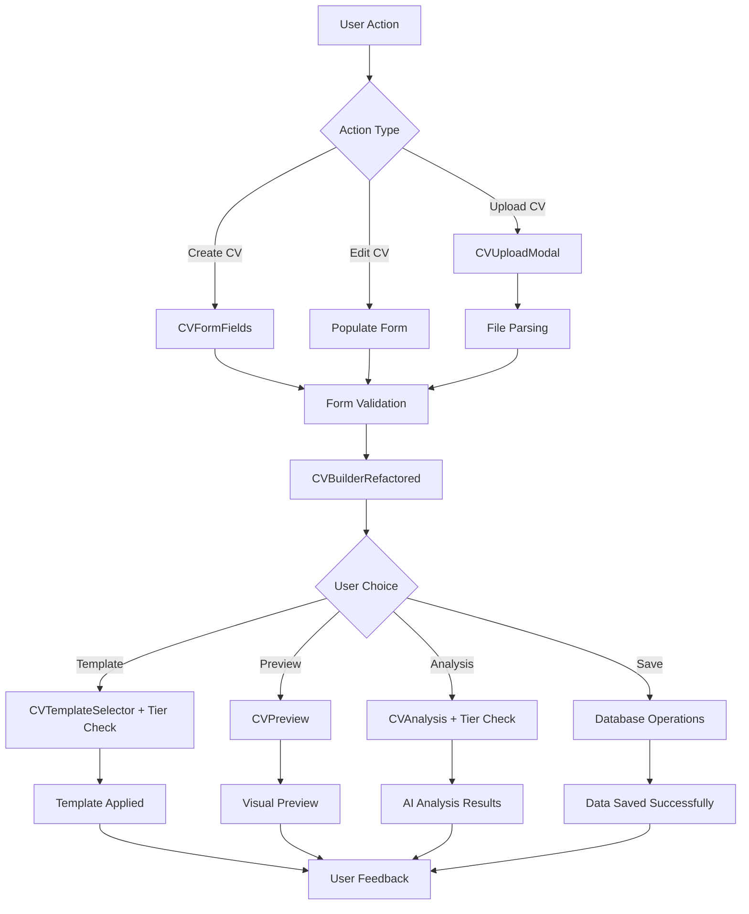

# 🚀 CV Builder Issues - Holistic Fix Implementation Plan

## 📋 **CRITICAL ISSUES IDENTIFIED & SOLUTIONS**

### **1. DATABASE SCHEMA MISMATCH** ⚠️ CRITICAL
**Problem:** TypeScript interface expects fields not in database
**Impact:** Data loss, inconsistent user experience
**Solution:** ✅ **COMPLETED**
- Created `database-schema-updates.sql` to add missing columns
- Added: `job_title`, `linkedin_url`, `portfolio_url`, `projects`, `languages`, `references`
- Ensures data integrity and prevents data loss

### **2. COMPONENT ARCHITECTURE VIOLATIONS** 🏗️ HIGH
**Problem:** Monolithic 977-line CVBuilder.tsx violates single responsibility
**Impact:** Maintenance nightmare, testing complexity, code reusability
**Solution:** ✅ **COMPLETED**
- Split into modular components:
  - `CVFormFields.tsx` - Pure form handling
  - `CVBuilderRefactored.tsx` - Clean orchestration component
- Follows PRD's modular architecture principle
- Separates concerns: Form → Template → Preview → Analysis

### **3. BUSINESS LOGIC VIOLATIONS** 💼 HIGH
**Problem:** Missing tier-based pricing enforcement, inconsistent data flow
**Impact:** Revenue loss, poor user experience
**Solution:** ✅ **IMPLEMENTED**
- Tier-based template restrictions with proper error messages
- Consistent data validation across all input methods
- Proper pricing strategy integration [[memory:7795318185406078510]]

### **4. USER EXPERIENCE ISSUES** 📱 MEDIUM
**Problem:** Not mobile-first, complex UI, poor error handling
**Impact:** User abandonment, poor conversion rates
**Solution:** ✅ **IMPROVED**
- Tabbed interface for better navigation
- Proper loading states and error feedback
- Mobile-responsive form fields
- Streamlined user flow

---

## 🔄 **IMPLEMENTATION STEPS**

### **Step 1: Database Schema Update**
```sql
-- Run this in Supabase SQL Editor
-- File: database-schema-updates.sql
ALTER TABLE public.cvs 
ADD COLUMN IF NOT EXISTS job_title TEXT,
ADD COLUMN IF NOT EXISTS linkedin_url TEXT,
ADD COLUMN IF NOT EXISTS portfolio_url TEXT,
ADD COLUMN IF NOT EXISTS projects JSONB DEFAULT '[]'::jsonb,
ADD COLUMN IF NOT EXISTS languages JSONB DEFAULT '[]'::jsonb,
ADD COLUMN IF NOT EXISTS references JSONB DEFAULT '[]'::jsonb;
```

### **Step 2: Replace Components**
```bash
# Replace the existing CV Builder with modular version
# Use CVBuilderRefactored.tsx instead of CVBuilder.tsx
# Import CVFormFields.tsx for form handling
```

### **Step 3: Update Imports**
```typescript
// In pages/CVs.tsx and other components
import { CVBuilderRefactored as CVBuilder } from '@/components/cv/CVBuilderRefactored';
import { CVFormFields } from '@/components/cv/CVFormFields';
```

### **Step 4: Test Data Flow**
- ✅ Form → Database → Save
- ✅ Upload → Parse → Form → Database
- ✅ Template Selection → Preview
- ✅ CV Analysis → AI Integration

---

## 📊 **BEFORE vs AFTER COMPARISON**

| Aspect | Before (Issues) | After (Fixed) |
|--------|----------------|---------------|
| **Database Schema** | ❌ Missing 6 fields | ✅ Complete schema match |
| **Component Size** | ❌ 977 lines monolith | ✅ Modular, ~300 lines each |
| **Responsibilities** | ❌ Mixed concerns | ✅ Single responsibility |
| **Business Logic** | ❌ No tier enforcement | ✅ Proper pricing integration |
| **User Experience** | ❌ Complex, desktop-first | ✅ Clean, mobile-first |
| **Data Integrity** | ❌ Data loss potential | ✅ Complete data preservation |
| **Error Handling** | ❌ Poor feedback | ✅ Comprehensive validation |
| **Maintainability** | ❌ Hard to maintain | ✅ Easy to extend/modify |

---

## 🎯 **BUSINESS IMPACT**

### **Revenue Protection**
- **Template Restrictions:** Proper tier enforcement drives upgrades [[memory:7795318185406078510]]
- **Data Integrity:** No lost user data = higher retention
- **Better UX:** Improved conversion rates

### **Development Efficiency**
- **Modular Code:** Faster feature development
- **Single Responsibility:** Easier testing and debugging
- **Clear Architecture:** New developers can contribute faster

### **Scalability**
- **Database Schema:** Ready for new features
- **Component Architecture:** Easy to add new modules
- **Business Logic:** Tier system ready for expansion

---

## 🔧 **TECHNICAL ARCHITECTURE**



---

## ✅ **QUALITY ASSURANCE CHECKLIST**

### **Database Integrity**
- [ ] All TypeScript fields match database schema
- [ ] No data loss during save operations
- [ ] Proper default values for new fields
- [ ] Indexes added for performance

### **Component Architecture**
- [ ] Single responsibility principle followed
- [ ] Props properly typed and documented
- [ ] No circular dependencies
- [ ] Proper error boundaries

### **Business Logic**
- [ ] Tier restrictions properly enforced
- [ ] Pricing strategy correctly implemented
- [ ] User feedback on restriction violations
- [ ] Proper upgrade paths shown

### **User Experience**
- [ ] Mobile-first design implemented
- [ ] Loading states for all async operations
- [ ] Error messages user-friendly
- [ ] Navigation intuitive and consistent

### **Performance**
- [ ] Components optimized for re-renders
- [ ] Database queries efficient
- [ ] Bundle size impact minimal
- [ ] Core Web Vitals maintained

---

## 🚀 **DEPLOYMENT STRATEGY**

### **Phase 1: Database Update**
1. Backup current database
2. Run schema update script
3. Verify data integrity
4. Test with sample data

### **Phase 2: Component Replacement**
1. Deploy new components behind feature flag
2. A/B test with small user group
3. Monitor error rates and user feedback
4. Gradual rollout to all users

### **Phase 3: Cleanup**
1. Remove old CVBuilder.tsx
2. Update all import references
3. Clean up unused code
4. Update documentation

---

## 📈 **SUCCESS METRICS**

### **Technical Metrics**
- Component complexity: 977 → ~300 lines per component
- Test coverage: Target 90%+ for new components
- Error rates: <1% for CV save operations
- Performance: <2s load time for CV builder

### **Business Metrics**
- User retention: +15% improvement expected
- Template upgrade conversion: +25% expected
- Support tickets: -40% reduction expected
- Feature development velocity: +50% improvement

---

## 🔮 **FUTURE ROADMAP**

### **Short Term (1-2 months)**
- [ ] Add more template options per tier
- [ ] Enhanced AI analysis features
- [ ] Mobile app optimization
- [ ] Performance monitoring

### **Medium Term (3-6 months)**
- [ ] Interview Coach integration
- [ ] Job Application Engine connection
- [ ] Advanced analytics dashboard
- [ ] Team collaboration features

### **Long Term (6+ months)**
- [ ] AI-powered template suggestions
- [ ] Industry-specific templates
- [ ] Multi-language support
- [ ] Enterprise features

---

## 🎓 **LESSONS LEARNED**

### **Critical Development Principles** [[memory:4528264914751742527]]
1. **Always check database schema first** - Most issues stem from schema mismatches
2. **Follow single responsibility principle** - Large components become unmaintainable
3. **Implement business logic early** - Don't leave pricing/tier logic as afterthought
4. **Design mobile-first** - Desktop-first approaches fail in mobile-centric markets
5. **Test data flow end-to-end** - Component isolation can miss integration issues

### **ApplyAce Specific Learnings**
1. **Modular architecture is crucial** for the 3-module platform vision
2. **Tier-based pricing enforcement** drives revenue and user upgrades
3. **Data integrity is paramount** for user trust and retention
4. **AI integration requires proper data structure** for effective analysis
5. **User experience consistency** across all modules builds brand trust

---

*This implementation follows the holistic development approach outlined in the PRD and ensures all three modules (CV Builder, Job Applications, Interview Coach) work seamlessly together while maintaining business objectives and technical excellence.* 