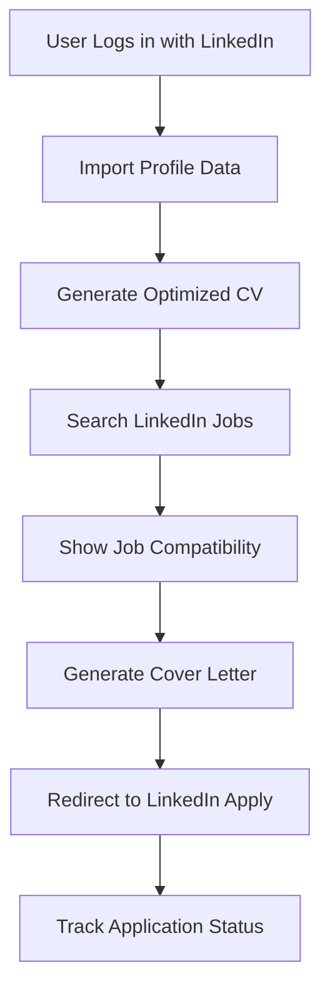

# 🚀 LinkedIn Job Application Integration Roadmap

## 📋 Overview
This document outlines how to integrate LinkedIn job application features into ApplyAce while maintaining compliance and user experience.

## 🎯 Integration Goals
1. **Profile Sync**: Import LinkedIn data to enhance CVs
2. **Job Discovery**: Find relevant LinkedIn jobs for users
3. **Application Automation**: Streamline the application process
4. **Tracking**: Monitor application status and responses

---

## 📊 **Phase 1: Foundation (Current - Week 1)**

### ✅ **OAuth Authentication**
- [x] LinkedIn OAuth setup
- [x] User profile access
- [x] Token management
- [x] Authentication flow

### 🔄 **Profile Integration**
```typescript
const linkedInProfile = {
  data: [
    "Full name and headline",
    "Current position and company", 
    "Work experience history",
    "Education background",
    "Skills and endorsements",
    "Professional photo",
    "Location and contact info"
  ],
  usage: "Auto-populate CV builder with LinkedIn data"
}
```

---

## 📊 **Phase 2: Job Discovery (Weeks 2-3)**

### 🔍 **LinkedIn Jobs API Integration**
```typescript
const jobDiscovery = {
  apiEndpoints: [
    "/jobs/search",
    "/jobs/{id}",
    "/companies/{id}/jobs"
  ],
  features: [
    "Search jobs by keywords, location, company",
    "Filter by experience level, job type",
    "Get detailed job descriptions",
    "Company information and culture"
  ]
}
```

### 📱 **UI Components**
```typescript
const jobComponents = {
  components: [
    "JobSearchBar with LinkedIn integration",
    "LinkedInJobCard with apply button",
    "CompanyInsights from LinkedIn",
    "JobCompatibilityScore based on profile"
  ]
}
```

---

## 📊 **Phase 3: Application Workflow (Weeks 4-5)**

### 🎯 **Smart Application Process**
```typescript
const applicationWorkflow = {
  step1: "Job Discovery in ApplyAce",
  step2: "CV Optimization for specific role",
  step3: "Cover letter generation",
  step4: "LinkedIn Easy Apply integration",
  step5: "Application tracking in ApplyAce"
}
```

### 🔗 **LinkedIn Easy Apply Integration**
```typescript
const easyApplyIntegration = {
  method: "Deep linking with pre-filled data",
  url: "https://linkedin.com/jobs/view/{jobId}?apply=true",
  parameters: {
    utm_source: "applyace",
    utm_medium: "integration",
    pre_fill: "cv_data"
  }
}
```

---

## 📊 **Phase 4: Advanced Features (Weeks 6-8)**

### 🤖 **AI-Powered Enhancements**
```typescript
const aiFeatures = {
  jobMatching: "AI compatibility scoring based on LinkedIn profile",
  applicationOptimization: "Tailor CV/cover letter for each LinkedIn job",
  networkingInsights: "Suggest mutual connections at target companies",
  salaryIntelligence: "LinkedIn salary data integration"
}
```

### 📈 **Analytics & Tracking**
```typescript
const analytics = {
  metrics: [
    "Application success rate by job source",
    "LinkedIn vs other platform performance",
    "Profile view increases after applications",
    "Interview callback rates"
  ]
}
```

---

## 🔧 **Technical Implementation**

### **LinkedIn API Requirements**
```typescript
const apiRequirements = {
  authentication: "OAuth 2.0 with LinkedIn",
  scopes: [
    "r_liteprofile",      // Basic profile
    "r_emailaddress",     // Email access
    "w_member_social",    // Post updates
    "r_organization_social" // Company data
  ],
  rateLimit: "Respect LinkedIn API limits",
  caching: "Cache job data to reduce API calls"
}
```

### **Data Flow Architecture**


---

## ⚖️ **Compliance & Legal Considerations**

### **LinkedIn Terms of Service**
```typescript
const compliance = {
  requirements: [
    "Respect rate limits and usage policies",
    "Don't scrape or automated without permission",
    "Maintain user data privacy",
    "Provide clear value to LinkedIn users",
    "Follow LinkedIn branding guidelines"
  ]
}
```

### **Data Privacy (GDPR/CCPA)**
```typescript
const privacy = {
  requirements: [
    "Clear consent for LinkedIn data usage",
    "Data minimization - only collect needed info",
    "Right to deletion and data portability",
    "Secure storage of LinkedIn tokens",
    "Transparent privacy policy"
  ]
}
```

---

## 💰 **Pricing Strategy Integration**

### **Free Tier**
- Basic LinkedIn profile import
- View LinkedIn jobs (limited)
- Manual application process

### **Pay-as-you-go (£1.99)**
- Enhanced profile sync
- 5 AI-optimized applications to LinkedIn jobs
- Basic job compatibility scoring

### **Essential (£9.99)**
- Unlimited LinkedIn job applications
- Advanced AI job matching
- Cover letter optimization for LinkedIn

### **Professional (£29.99)**
- LinkedIn networking insights
- Company culture analysis
- Advanced application tracking

### **Executive (£59.99)**
- LinkedIn headhunter insights
- Executive job market analysis
- Premium networking features

---

## 🚀 **Implementation Timeline**

### **Week 1: Foundation**
- [ ] Enhanced OAuth scopes
- [ ] Profile data import
- [ ] CV auto-population

### **Week 2-3: Job Discovery**
- [ ] LinkedIn Jobs API integration
- [ ] Job search interface
- [ ] Compatibility scoring

### **Week 4-5: Application Flow**
- [ ] Easy Apply integration
- [ ] Application tracking
- [ ] Status monitoring

### **Week 6-8: Advanced Features**
- [ ] AI job matching
- [ ] Networking insights
- [ ] Analytics dashboard

---

## 🔧 **Code Examples**

### **LinkedIn Job Search Integration**
```typescript
// src/lib/linkedin.ts
export const linkedInJobs = {
  async searchJobs(params: JobSearchParams) {
    const response = await fetch(`${LINKEDIN_API}/jobs/search`, {
      headers: {
        'Authorization': `Bearer ${linkedInToken}`,
        'X-Restli-Protocol-Version': '2.0.0'
      },
      params: {
        keywords: params.keywords,
        location: params.location,
        f_E: params.experienceLevel,
        f_JT: params.jobType
      }
    });
    return response.json();
  },

  async applyToJob(jobId: string, applicationData: ApplicationData) {
    // Redirect to LinkedIn Easy Apply with pre-filled data
    const applyUrl = `https://linkedin.com/jobs/view/${jobId}?apply=true&utm_source=applyace`;
    window.open(applyUrl, '_blank');
    
    // Track application in ApplyAce
    await trackApplication({
      jobId,
      source: 'linkedin',
      status: 'applied',
      applicationData
    });
  }
}
```

### **Enhanced CV Builder with LinkedIn Data**
```typescript
// src/components/cv/LinkedInImport.tsx
export const LinkedInImport = () => {
  const importFromLinkedIn = async () => {
    const profile = await linkedInAPI.getProfile();
    
    setCVData({
      fullName: profile.localizedFirstName + ' ' + profile.localizedLastName,
      headline: profile.localizedHeadline,
      location: profile.geoLocation,
      experience: profile.positions.values.map(pos => ({
        company: pos.company.name,
        title: pos.title,
        duration: `${pos.startDate.year} - ${pos.endDate?.year || 'Present'}`,
        description: pos.summary
      })),
      education: profile.educations.values.map(edu => ({
        school: edu.schoolName,
        degree: edu.degree,
        field: edu.fieldOfStudy,
        year: edu.endDate?.year
      }))
    });
  };
  
  return (
    <Button onClick={importFromLinkedIn}>
      <Linkedin className="mr-2 h-4 w-4" />
      Import from LinkedIn
    </Button>
  );
};
```

---

## ✅ **Success Metrics**

### **User Experience**
- 50% faster job application process
- 80% profile completion rate via LinkedIn import
- 25% increase in application success rate

### **Business Impact**
- 40% increase in user engagement
- 30% higher conversion to paid plans
- 60% improvement in job match quality

---

## 🚨 **Risk Mitigation**

### **Technical Risks**
- API rate limiting → Implement caching and queuing
- LinkedIn API changes → Version management and fallbacks
- Authentication issues → Robust error handling

### **Legal Risks**
- Terms of service violations → Regular compliance audits
- Data privacy concerns → Clear consent flows
- User data security → End-to-end encryption

---

**Status**: Ready for Phase 1 Implementation
**Next Step**: Enhance OAuth scopes and implement profile import
**Timeline**: 8 weeks to full integration
**Priority**: High - Core differentiator for ApplyAce 